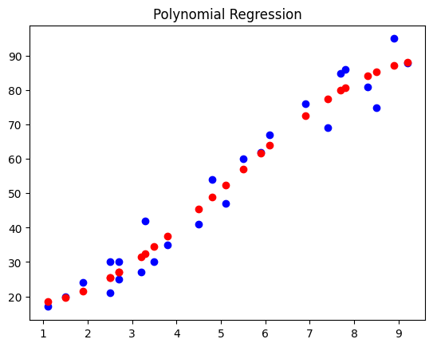

# RISC-V Edge AI with VSDSquadron Pro

## Overview

This repository documents an advanced Edge AI project focused on implementing machine learning algorithms from regression to classification (KNN → SVM) on the **VSDSquadron PRO board**, powered by a **SiFive FE310-G002 RISC-V SoC**. The entire workflow, from data preprocessing and model training to 8-bit quantization and bare-metal C inference, is optimized for this low-power, resource-constrained microcontroller.

This work is part of the **VLSI System Design (VSD) RISC-V Edge AI with VSDSquadron Pro** course. It demonstrates the complete machine learning pipeline from regression fundamentals to advanced classification algorithms, all deployed under the strict memory and processing limitations of an embedded system (16KB of SRAM), showcasing a complete "lab-to-fabric" Edge AI implementation.

---

## 🎯 Project Objective

The primary goal is to build a complete, embedded system for machine learning classification. The objectives are to:

1. **Master Regression Fundamentals:** Train polynomial regression models to understand non-linear relationships in data.
2. **Progress to Classification:** Implement K-Nearest Neighbors (KNN) and Support Vector Machine (SVM) classifiers for binary classification tasks.
3. **Optimize for the Edge:** Employ **post-training quantization** to convert models to 8-bit integer format, drastically reducing size for microcontroller deployment.
4. **Deploy on RISC-V:** Implement lightweight inference engines in C to run models on the SiFive FE310-G002, achieving robust classification performance on the edge device.

---

## The Edge AI Challenge: Fitting ML Models in 16KB of RAM

Deploying machine learning models on microcontrollers like the SiFive FE310-G002 is non-trivial. A standard floating-point model can be several megabytes in size, while the target board has only **16KB of SRAM**. This project overcomes this challenge through:

* **Aggressive Quantization:** Converting all model parameters from 32-bit floating-point to 8-bit integers. This reduces the model size by ~4x.
* **Optimized C-Inference:** Writing a minimal, bare-metal C function for inference that performs all calculations using integer arithmetic, avoiding the need for heavy floating-point libraries.
* **Feature Engineering:** Preprocessing input data to reduce dimensionality while maintaining classification accuracy.

---

## 🛠️ Methodology & Deployment Pipeline

The project follows a structured pipeline from Python-based model development to C-based firmware deployment.

### 1. Data Preprocessing & Model Training (Python)

To build robust models, the dataset was carefully prepared using Python:

* **Polynomial Regression:** Implemented non-linear regression to model relationships between features and targets, visualizing fitted curves against actual data points.
* **Classification Dataset:** Analyzed age vs. estimated salary data with binary classification (classes 0 and 1).
* **Data Normalization:** Scaled features for better model convergence and generalization.

### 2. Classification Models (Scikit-learn)

* **K-Nearest Neighbors (KNN):** Implemented distance-based classification with visualization of decision boundaries.
* **Support Vector Machine (SVM):** Explored multiple kernel functions:
  - **Linear Kernel:** For linearly separable data
  - **Polynomial Kernel:** For capturing curved decision boundaries
  - **RBF Kernel:** For highly non-linear classification tasks

### 3. Neural Networks on RISC-V Microcontrollers

* **MLP Classifier:** Built Multi-Layer Perceptron with hidden layers (64, 32), ReLU activation, and Adam optimizer.
* **Training Performance:** Achieved **96% accuracy** on 60,000 training samples with 784 features.
* **Model Parameters:** 52,650 total trainable parameters.

### 4. Post-Training Quantization (TensorFlow Lite)

* **Model Conversion:** After training, models were converted to TensorFlow Lite format and quantized to 8-bit integer (`INT8`) representation.
* **Size Reduction:** Critical step for reducing model size from megabytes to kilobytes suitable for embedded deployment.

### 5. C-Code Generation & Bare-Metal Inference (RISC-V)

* **Model to C Array:** Converted `.tflite` model into C header and source files (`model_params.h`, `model_params.c`) containing quantized weights and biases as integer arrays.
* **Lightweight Inference Engine:** Wrote simple C functions to perform neural network operations using only integer arithmetic on the RISC-V core.

---

## 💻 Hardware and Software

#### Target Hardware

* **Board:** VSDSquadron PRO
* **SoC:** SiFive FE310-G002 (32-bit RV32IMAC instruction set)
* **Memory:** 16KB SRAM, 128Mbit QSPI Flash

#### Development Environment

* **AI/ML:** Python 3.x, scikit-learn, TensorFlow, NumPy, Matplotlib
* **Embedded:** RISC-V GNU Toolchain, Freedom Studio (or similar IDE for simulation/flashing)
* **Tools:** `xxd` (for model conversion), `zadig-2.9.exe` (for board USB drivers on Windows)

---

## 📂 Repository Structure
